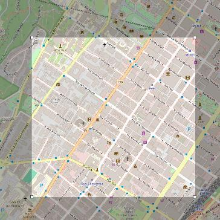
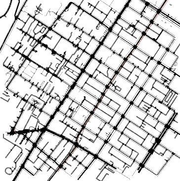
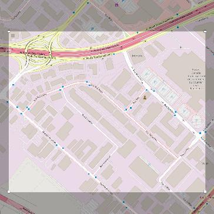
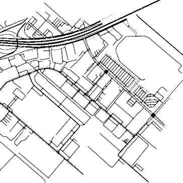
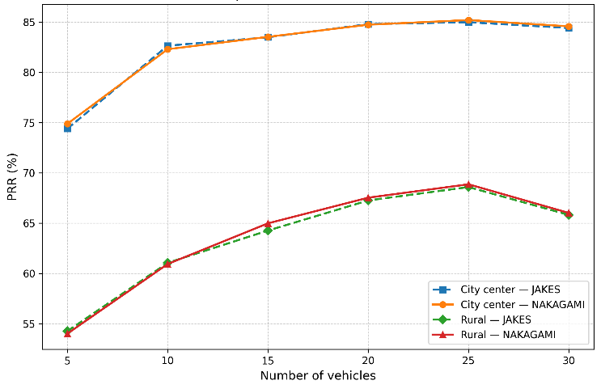
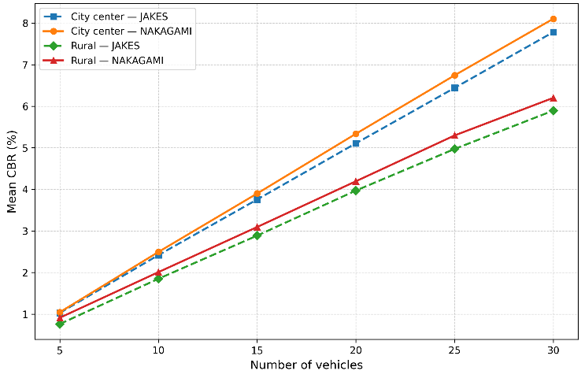

# C-V2X Mode 4 Reliability Across Montreal Scenarios

**A simulation and data-analysis study of direct C-V2X broadcast reliability on two real Montreal road layouts.**

> How does broadcast reliability change as more vehicles share the channel, and how strongly do road layout and fading affect the result?

I built a controlled C-V2X Mode 4 experiment using OMNeT++, Veins, SUMO, and OpenCV2X. Vehicles exchanged 190-byte broadcast messages over direct sidelink communication. I varied the road environment, vehicle count, and fading model, then used Python to measure packet reception rate, channel occupancy, and receiver-level variation.

## Study at a glance

| Item | Evaluated setting |
| --- | --- |
| Road environments | Dense Montreal city-center grid and lower-density corridor |
| Communicating vehicles | 5, 10, 15, 20, 25, and 30 |
| Fading models | JAKES and NAKAGAMI |
| Experiment matrix | 24 scenario/fading/vehicle-count combinations |
| Simulation time | 100 seconds per run |
| Radio configuration | 23 dBm transmit power; 3 subchannels; 16 resource blocks per subchannel |
| Main outputs | Aggregate PRR, per-receiver PRR statistics, and mean CBR |

## The two Montreal scenarios

The road layouts provide a controlled geometric contrast while the communication configuration remains fixed.

### 1. City-center grid

A dense street network with short blocks, frequent intersections, and many possible vehicle-to-vehicle reception paths.

| Selected OpenStreetMap area | SUMO road network |
| --- | --- |
|  |  |

### 2. Lower-density corridor

A more open layout with longer road segments, fewer intersections, and a strong highway-corridor component.

| Selected OpenStreetMap area | SUMO road network |
| --- | --- |
|  |  |

Map data and imagery: **© OpenStreetMap contributors**.

## From road map to performance metrics

1. **Build the road environment.** OpenStreetMap extracts are converted into SUMO networks, routes, trips, and polygons.
2. **Generate vehicle mobility.** SUMO controls vehicle movement across each Montreal scenario.
3. **Connect mobility and communication.** Veins couples SUMO with the OMNeT++ event simulation.
4. **Model direct C-V2X.** OpenCV2X/SimuLTE provides the Mode 4 sidelink stack and resource-selection behavior.
5. **Export the results.** OMNeT++ `scavetool` converts scalar and vector outputs to CSV.
6. **Analyze the runs.** The Python workflow groups each scenario and calculates PRR, receiver-level statistics, and CBR.

```text
OpenStreetMap -> SUMO -> Veins -> OMNeT++ / OpenCV2X -> scavetool -> Python
 road layout     mobility   coupling    C-V2X Mode 4          CSV       metrics
```

## What was measured

| Metric | Purpose |
| --- | --- |
| Packet reception rate (PRR) | Measures successful receptions across all possible receiving vehicles |
| Receiver-side PRR | Shows how evenly reliability is distributed among individual vehicles |
| Receiver-side standard deviation, minimum, and maximum | Captures reception disparity within a run |
| Mean channel busy ratio (CBR) | Measures average sensed channel occupancy |

The formulas and scalar-selection rules are documented in [the methodology](docs/methodology/README.md).

## Results

### Packet reception rate



- City-center PRR rose from **74.39% / 74.88%** at five vehicles to **84.98% / 85.20%** at 25 vehicles for JAKES and NAKAGAMI.
- Lower-density PRR rose from **54.26% / 54.01%** to **68.59% / 68.87%** over the same range.
- PRR declined slightly at 30 vehicles in all four cases, marking 25 vehicles as the best observed point in this experiment.
- The city-center layout led the lower-density layout by **16.33 to 21.59 percentage points** across matched cases.

### Channel occupancy



- Mean CBR increased with vehicle count, reaching **8.11%** in the city-center scenario and **6.20%** in the lower-density scenario.
- The channel remained below 9% busy in the tested configurations, even where PRR began to decline.

> In the original result-figure legends, **Rural** is the short label for the lower-density Montreal corridor.

## Engineering interpretation

- **Road layout had the strongest effect.** The dense city-center network consistently produced higher aggregate PRR.
- **The fading choice had a small effect.** The largest JAKES-to-NAKAGAMI PRR difference was 0.72 percentage points.
- **Receiver experience was less uniform in the lower-density scenario.** Its receiver-side PRR spread was wider and its minimum values were lower.
- **More vehicles helped until the highest tested load.** Reception opportunities improved through 25 vehicles; the decline at 30 vehicles coincided with higher channel occupancy.

## Repository guide

| Path | Contents |
| --- | --- |
| [`analysis/`](analysis/) | Python batch analysis, metric aggregation, and plotting |
| [`data/raw/`](data/raw/) | Two representative OMNeT++ CSV exports stored as gzip files |
| [`docs/methodology/`](docs/methodology/) | Experimental design, formulas, and configuration reference |
| [`figures/maps/`](figures/maps/) | OpenStreetMap selections and SUMO topology views |
| [`figures/results/`](figures/results/) | PRR and CBR comparison plots |
| [`simulation/omnet-project/`](simulation/omnet-project/) | OMNeT++, OpenCV2X, Veins, and SUMO configuration files |

## Run the analysis

Install the two Python dependencies:

```powershell
python -m pip install -r analysis/requirements.txt
```

Run the batch workflow on `scavetool` CSV exports:

```powershell
python analysis/extended_metrics_batch_plot.py `
  --input-dir PATH_TO_CSV_EXPORTS `
  --pattern "*.csv" `
  --output-dir metrics_outputs
```

Input filenames encode the scenario, fading model, and vehicle count, for example `city_center_Nakagami_05.csv`. Each execution creates a timestamped output directory with detailed metrics, grouped summaries, a compact results table, and both plots.

## Simulation entry points

- [`omnetpp.ini`](simulation/omnet-project/omnetpp.ini) contains the main experiment configuration.
- [`Highway.ned`](simulation/omnet-project/Highway.ned) defines the Mode 4 network.
- [`config_channel.xml`](simulation/omnet-project/config_channel.xml) contains propagation and fading settings.
- [`sidelink_configuration.xml`](simulation/omnet-project/sidelink_configuration.xml) contains resource-selection parameters.
- [`highway/`](simulation/omnet-project/highway/) contains the three Montreal SUMO scenario bundles tied to the active configuration or bundled data.

The `.launchd.xml` files contain `/home/veins/...` paths from the original Linux setup. Update the `basedir` values and install compatible versions of OMNeT++, SUMO, Veins, INET, and OpenCV2X before running the simulation on another machine.

## Technology

`OMNeT++` · `Veins` · `SUMO` · `INET` · `SimuLTE/OpenCV2X` · `Python` · `pandas` · `Matplotlib`

## License and attribution

Project code and documentation are released under `LGPL-3.0-only`. OpenStreetMap-derived assets remain subject to the Open Database License. The included `Highway.ned` file retains its SimuLTE/OpenCV2X LGPL terms. See [LICENSES.md](LICENSES.md) and [NOTICE.md](NOTICE.md).
